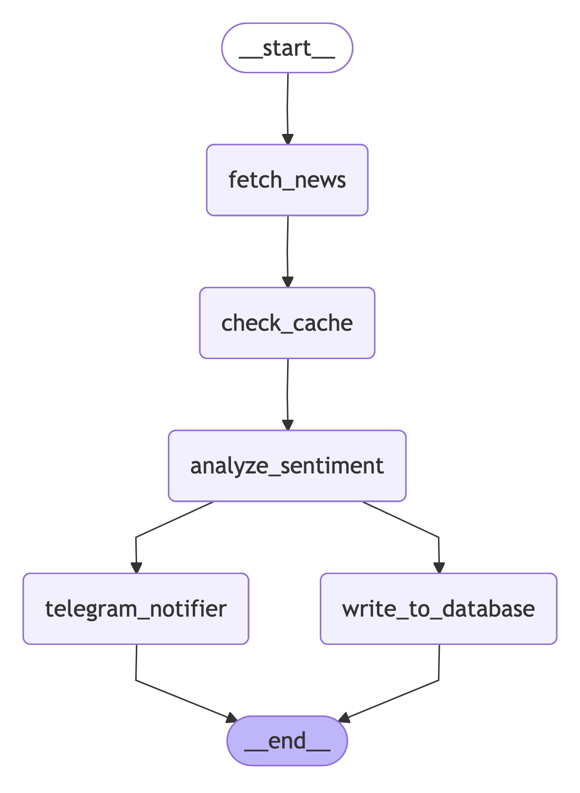

# Crypto News Monitoring Pipeline
[](https://github.com/langchain-ai/langgraph)
[](https://python.org)
[](https://openai.com)
[](LICENSE)
[]()

> An automated cryptocurrency news aggregation and analysis pipeline built with LangGraph. Fetches news from external APIs, performs sentiment analysis, stores processed data in MongoDB, and sends notifications through Telegram.


## Features

- **Automate News Collection**: Fetches the latest news from external API (cryptonews-api.com) and structures data into standardized format.
- **Caching**: A caching strategy to prevent duplicate processing of news items to optimize costs and performance.  
- **Sentiment Analysis**: Performs sentiment analysis on news content to determine potential impact on cryptocurrency prices.
- **MongoDB Integration**: Stores processed news items with sentiment data in a MongoDB database for persistence and further analysis.
- **Telegram Notifications**: 1. Sends real-time alerts and notifications about significant news events directly to Telegram.

## Table of Contents

- [About](#about)
- [Workflow Diagram](#workflow-diagram)
  - [Nodes](#nodes)
- [Getting Started](#getting-started)
  - [Prerequisites](#prerequisites)
  - [Installation](#installation)
  - [Configuration](#configuration)
- [Usage](#usage)
- [License](#license)
- [Contact](#contact)
- [Acknowledgments](#acknowledgments)
---
## About

Keeping up with the latest news and trends in the cryptocurrency market is a critical task for any investor. This project aims to automate this process by building a news monitoring pipeline that collects, analyzes, and stores cryptocurrency news in a MongoDB database. The pipeline also sends real-time notifications to Telegram about the latest news events.

---
## Workflow Diagram

The pipeline is designed to execute at one-minute intervals, ensuring near real-time monitoring of cryptocurrency news. Below is a visual representation of the system's architecture and data flow:



## Nodes

Each node in the workflow is responsible for a specific task. Here is a list of the nodes and their responsibilities:

### 1. Fetch News
Fetches last 10 news from cryptonews-api.com and assign a unique ID to each news item.

**Reads:**
- Empty state of the graph.

**Writes:**
- `state["raw_news"]`: A list of news items. Here is the schema of each news item:
```python
class NewsItem(BaseModel):
    """Single news item schema from the news API"""
    id: str
    title: str
    text: str
    source_name: str
    news_url: str
    image_url: str
    timestamp: datetime.datetime
```

### 2. Check Cache
Loads the cache and checks if the news item is already in the cache. If so, exclude it from the list of news items to be processed.

**Reads:**
- `state["raw_news"]`

**Writes:**
- `state["cache"]`: A list of cached news items.
- `state["cache_hit"]`: An integer indicating number of items found in the cache.
- `state["unseen_news"]`: A list of news items without cached news items.

### 3. Analyze Sentiment
Process each news item with LLM to extract sentiment, importance, and a flag indicating whether the news item can have an impact on price or no.

**Reads:**
- `state["unseen_news"]`

**Writes:**
- `state["processed_news"]`: A list of processed news items. Here is the schema of each item:
```python
class ProcessedNewsItem(BaseModel):
    """Single news item schema after processing the news with LLM"""
    id: str
    title: str
    text: str
    source_name: str
    news_url: str
    image_url: str
    sentiment: Sentiment  # New field
    importance: Importance  # New field
    is_market_relevant: bool  # New field
    timestamp: datetime.datetime
```

### 4. Write to Database
Writes the processed news items to the MongoDB database.

**Reads:**
- `state["processed_news"]`

**Writes:**
- `state["database_write_success"]`: A boolean indicating whether the write operation was successful.


### 5. Telegram Notifications
Creates a telegram message and sends the processed news items to a Telegram group. 

**Reads:**
- `state["processed_news"]`

**Writes:**
- `state["telegram_notification_success"]`: A boolean indicating whether the message was sent successfully.

---
## Getting Started

### 1. Prerequisites

- Python 3.12
- MongoDB URI and database name
- OpenAI API key
- Telegram Bot token and group ID
- News API key
- Optional: LangSmith API key

### 2. Installation

Clone the repository:

```bash
git clone https://github.com/PeymanKh/crypto_news_pipeline.git
cd crypto_news_pipeline
```

Install the required dependencies:

```bash
pip install -r requirements.txt
```

### 3. Configuration

This project uses a robust Pydantic configuration system with environment variable validation and cloud deployment support.

### Setup Environment Variables

1. **Copy the example configuration:**
   ```bash
   cp .env.example .env
   ```

2. **Edit the `.env.example` file with your actual values:**
   ```bash
   # See .env.example for complete list of required variables
   OPENAI_API_KEY=sk-your-openai-api-key-here
   BOT_TOKEN=your-telegram-bot-token  
   NEWS_API_KEY=your-news-api-key
   DB_URI=mongodb://localhost:27017
   ...
   ...
   ...
   ```

### Configuration Structure

The project automatically validates and loads configuration using Pydantic. See [`src/config/config.py`](src/config/config.py) for the complete list of required environment variables and their descriptions. The configuration includes:

- **Application Settings**: Name, version, environment, debug mode
- **Database Configuration**: MongoDB connection URI and database name
- **LLM Configuration**: OpenAI model name and API key
- **Telegram Bot**: Bot token and group ID for notifications
- **News API**: API key and endpoint URL for crypto news
- **LangSmith**: Observability and tracing configuration (optional)

### Configuration Classes

The main configuration class structure:

```python
class SystemConfig(BaseSettings):
    # Application configurations
    app_name: str = "crypto-news-pipeline"
    app_version: str = "1.0.0"
    environment: str = "development"
    debug: bool = True

    # Database configurations
    db_uri: SecretStr
    db_name: str

    # LLM configurations
    model_name: str = "gpt-4o"
    model_api_key: SecretStr

    # Telegram configurations
    bot_token: SecretStr
    group_id: SecretStr

    # News API configurations
    news_api_key: SecretStr
    news_url: str

    # LangSmith configurations
    langchain_tracing_v2: bool = False
    langsmith_api_key: SecretStr
    langsmith_project: str = "crypto-news-pipeline"
```

### Security Features

- **SecretStr fields** for sensitive data (API keys, tokens, URIs)
- **Validation on startup** - application exits if configuration is invalid  
- **GCP Secret Manager** support for cloud deployments
- **Environment-based loading** (.env for local, environment variables for production)
- **Strict validation** with Pydantic's `forbid` extra fields policy


---
## Usage

Here is a simple example of how you can run the application:
```python
from src.state import GraphState
from src.main import create_graph
from langgraph.checkpoint.memory import InMemorySaver

# Create a graph builder
graph_builder = create_graph()

# Compile it with a memory checkpoint
memory = InMemorySaver()
graph = graph_builder.compile(checkpointer=memory)

# Create state and thread configuration
state = GraphState()
thread = {"configurable": {"thread_id": "test"}}

# Invoke the graph with initial state and thread configuration
result = graph.invoke(state, thread)
```
---

## License
This project is licensed under the `MIT License`. see the [LICENSE](LICENSE) file for details.

---
## Contact

- **Project Link:** [https://github.com/PeymanKh/crypto_news_pipeline.git](https://github.com/PeymanKh/crypto_news_pipeline.git)
- **Author's Website:** [peymankh.dev](https://peymankh.dev)
- **Author's Email:** [peymankhodabandehlouei@gmail.com](mailto:peymankhodabandehlouei@gmail.com)

---
## Acknowledgments
This project's development was greatly supported by the insights and resources provided by the following entities and individuals:
- **[LangChain Academy](https://academy.langchain.com)**: The foundational framework for the pipeline's architecture and the educational resources for building multi-agent systems.
- **[BlockchainIST Center (Bahçeşehir University)](https://blockchainistcenter.com)**: This project was developed during my time at the center, leveraging the invaluable academic environment and resources of Turkey's first university-level research and development center in blockchain technology.
- **[Dr. Bora Erdamar](https://www.boraerdamar.net)**: I would like to specifically acknowledge the mentorship of Dr. Erdamar, Director of the BlockchainIST Center, whose expertise and guidance were instrumental in this project's development.